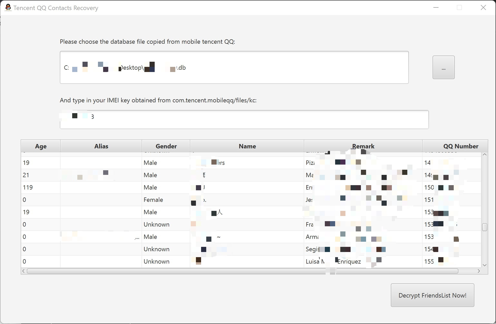

# Tencent QQ Friend List Decipherment Utility

***NOTE: The source code and working principle of this program is only for research and for emergency use to recover data when the account is blocked. DO NOT USE IT FOR ILLEGAL PURPOSES. All legal consequences arising from it have NOTHING to do with me!***

A Chinese friend of mine recently had his QQ blocked for no apparent reason but could not be unblocked and was unable to contact his important contacts during this time. 

To solve his problem, I reverse-engineered the QQ software for the Android client, studied the location of its database storage and the encryption algorithm of its fields, and thus recovered the nicknames, ID numbers, note names, ages, genders and other various information of the contacts cached by the mobile QQ. This greatly facilitates the recovery of important contacts, as we can add friends through the auxiliary QQ account.

Now I share this utility with you to help you get through a difficult time. 😊

------

### How to use: 

1.  Let your Android System have root permissions, and then install a file explorer software that can browse "root" protected files and folders. (e.g. MT Manager, Root Explorer, ES Explorer, etc.)
2.  Go to "/data/data/com.tencent.mobileqq/databases" folder and find the database file called "\<qqid\>.db", where qqid is your QQ number.
3.  Then switch to "/data/data/com.tencent.mobileqq/files" folder and open the file called "kc" as plain text. Write down or copy the content of this file (Generally, the contents of the file are pure numbers, which are calculated from the IMEI numbers of all SIM cards in your phone).
4.  Open my software, fill in file path (or choose via dialog by clicking the button) and key, and eventually you will see the TableView control on the screen with the decrypted data already displayed.

------

### Screenshot:

